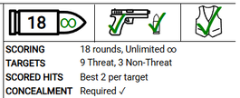
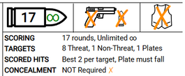
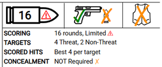

# TyrWSB

Written Stage Briefing (WSB) Templates and post-processing scripts for Practisim Designer HTML Export.


## IDPA

Designed to look and feel like the default PractisimDesigner IDPA Template with less clutter and cleaner output.

_Lukna IDPA Proarmis Cup 2027 Match Book with stages will be linked here once released for showcase._

#### Hint Icons

Pictographic elements have been added that serve as a "hint system" for basic stage information shooter should know at a glance:
- Amount of rounds and Scoring type (Unlimited or Limited).
- Start condition (loaded with chamber full, loaded with chamber empty or empty).
- Concealment requirement.




_Vectors and icons by [SVG Repo](https://www.svgrepo.com)._


## Usage

1. Install requirements.
    ```sh
    $ python -m venv venv
    $ source venv/bin/activate
    $ pip install -r requirements.txt
    ```
2. Improve the template exported to HTML in Practisim Designer Web.
    ```sh
    $ python idpawsb.py -t "IDPA/Tyr IDPA Template.html"
    -> "IDPA/Tyr IDPA Template Improved.html"
    ```
3. Export stages in Practisim Designer with the improved template.
4. Process exported stages.
    ```sh
    $ python idpawsb.py "../Match/Stages/Stage 1.html"
    -> "../Match/Stages/Stage 1 Processed.html"
    ```

### Arguments

Process multiple exported stages with a version tag.

```sh
$ python idpawsb.py --tag-version "v1-distances" "../Match/Stages/Stage {1,2,3}.html"
-> "../Match/Stages/Stage 1 Processed.html"
-> "../Match/Stages/Stage 2 Processed.html"
-> "../Match/Stages/Stage 3 Processed.html"
```

Process multiple stages removing retaining only the first 2 pages (removing 3rd page).

```sh
$ python idpawsb.py --tag-version "v1" --pages 1 2 "../Match/Stages/Stage 1.html"
-> "../Match/Stages/Stage 1 Processed.html"
```

## PDF Generation

Run [Gotenberg](https://gotenberg.dev/) API.

```sh
$ docker run --rm -p "3000:3000" gotenberg/gotenberg:8
```

Convert HTML to PDF.

```sh
$ python pdfwsb.py "../Match/Stages/Stage {1,2,3} Processed.html"
-> "../Match/Stages/Stage 1 Processed.pdf"
-> "../Match/Stages/Stage 2 Processed.pdf"
-> "../Match/Stages/Stage 3 Processed.pdf"
```

Merge PDFs.

```sh
$ python pdfwsb.py -m "../Match/Stages/Stage {1,2,3} Processed.pdf" -o "Stages.pdf"
-> "../Match/Stages/Stages.pdf"
```
